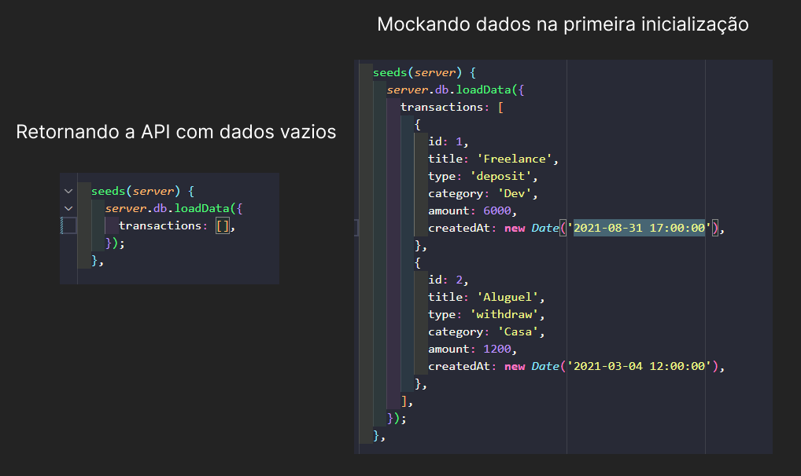

# Projeto Wamoney

Wamoney é um Projeto desenvolvido durante o Ignite 2021, curso de especialização em ReactJS da 
Rocketseat, a proposta era criar com um website para controle de dinheiro.


## Tecnologias usadas

**Client:** React, Typescript, Styled Components

**Server:** Foi criado um mock de API Rest usando o MirageJS


## Algumas imagens do projeto


Inicialmente o projeto traz uma lista vazia de saidas e entradas mas você pode modificar
isso preenchendo o array de "transactions", exemplo na imagem a seguir:



## Adicionando uma Saida


Caso o total for negativo ele assume o background "red"

## Adicionando uma Entrada


Caso positivo é alterado para o background "green"
## Rodando localmente

Faça o clone do projeto 

```bash
  git clone https://github.com/WillAngelis/wamoney.git
```

Vá ate a pasta wamoney

```bash
  cd wamoney
```

Instale as dependências

```bash
  npm install
```

Ou 

```bash
  yarn
```

Rode a aplicação

```bash
  npm run start
```

Ou

```bash
  yarn start
```


## Aprendizados

Os principais aprendizados neste projetos foram o mock de uma API Rest usando o MirageJS e as estilizações usando Styled-Components.


Vale lembrar que este projeto também contribuiu com mais conhecimentos em como organizar componentes em React e o uso de custom de hooks.